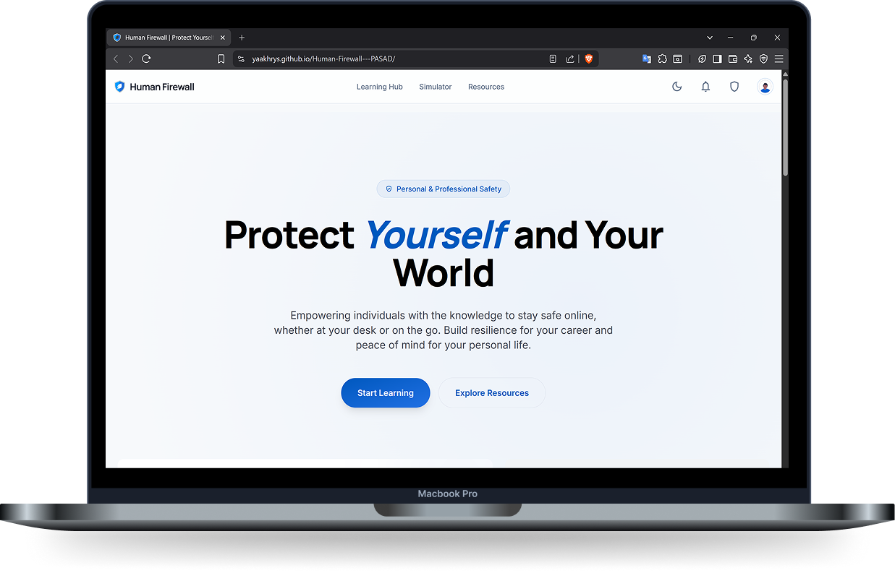
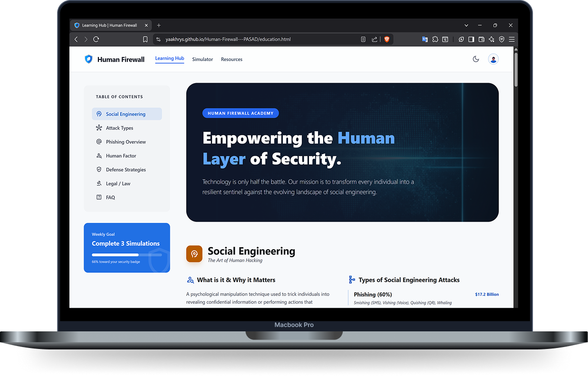
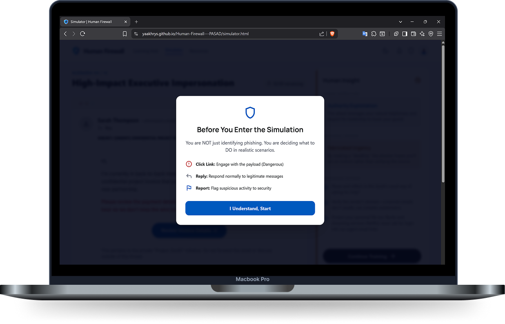

# PASAD 🛡️

### **AmaliTech Internship Training Program — Group 2 Project**
The Phishing Attack Simulation & Awareness Defense (PASAD) platform. Bridging the gap between technical security and human psychology to build a resilient Human Firewall.

This interactive, frontend-only toolkit educates users on phishing's psychological and technical aspects, tailored for the Ghanaian and global digital landscape.

<br><br>

### 🚀 Project Overview

This project was developed as part of the AmaliTech Internship Training Program. The team researched phishing attacks, designed simulations, and developed prevention strategies.

The project went beyond basic requirements by building a functional web application toolkit to serve as a permanent learning resource for individuals and organizations.

<br><br>

### 📸 Preview

> *Application screenshots and key visuals*
#### Homepage


#### Learning Hub


#### Simulator


#### Resources


<br><br>

### 👥 Team Members

*   Moumouni Dao — [LinkedIn](YOUR_LINK)
*   Christabell Owusu — [LinkedIn](https://www.linkedin.com/in/christabell-owusu/)
*   Gerald Teye Adjei — [LinkedIn](https://www.linkedin.com/in/gerald-teye-ab7866232/)

<br><br>

### 🛠️ Technology

This project demonstrates a **Human–AI Collaboration workflow**, combining design tools, AI-assisted development, and manual refinement.

*   **Frontend:** HTML5, Tailwind CSS (v3.4), JavaScript (ES6+).
*   **Design System:** Google Material Symbols & Google Fonts (Manrope, Inter).
*   **AI Collaborators:**
    *   Google AI Mode: Prompting, code assistance, debugging, and iterative refinement of logic and content.
    *   Google Stitch: UI/UX prototyping and layout engine.
    *   Google AI Studio: Structure and modularization stitched code into organized HTML, CSS, and JavaScript files.
    *   ChatGPT (GPT): Initial brainstorming, idea development, and structuring concepts.
    *   Canva: High-fidelity AI poster, visual alignment & composition, layout refinement, and document design.
    *   Google Workspace: Team collaboration, communication, and resource sharing.
    *   Others (Freepik, Gogole Images, & Undraw): Web application icons - pngs & svgs.

<br><br>


### 📂 Project Structure

```text
PASAD/
├── assets/
│   ├── style.css        # Global styles & Dark Mode overrides
│   ├── script.js        # UI Logic & Theme toggle handling
│   ├── images/          # Scenarios, Posters, Logos, and Icons
│   └── docs/            # High-resolution PDF awareness guides
├── index.html           # Home: Project Vision & Executive Summary
├── education.html       # Learning Hub: Psychology & Human Factors
├── simulator.html       # Attack Simulator: Deceptive Mockups
├── results.html         # Analysis: Why users fall for attacks
└── resources.html       # Toolbox: GRC Framework & Downloads

```

<br><br>

### 🎯 Key Project Features

✅ **Phishing Research & Attack Mapping:** Research into phishing and social engineering attacks.<br>
✅ **Phishing Simulations:** Design phishing scenarios (emails, messages, and login interfaces) to demonstrate attacks.<br>
✅ **User Behavior Simulation & Analysis:**  Human factors, Users Psychology & Response, and Statistics.<br>
✅ **Detection & Prevention Strategies:** Practical identification and prevention of phishing (individuals & organizations).<br>
✅ **Local Context (Ghana-Focused):** Focus on Mobile Money (MoMo) fraud and Ghanaian-specific attack vectors.<br>
✅ **Legal & Compliance Awareness:** GRC, Ghana Data Protection (Act 843) & Cybersecurity Authority (CSA) protocols.<br>
✅ **Awareness & Educational Materials:** Creation of cybersecurity awareness resources, including:
- Sample phishing emails and mockups  
- Analysis of why users fall for phishing  
- Practical safety recommendations  
- 4× premium downloadable posters:
  - 3-Second Rule  
  - Human Firewall  
  - Red Flag Anatomy  
  - Passphrases 
 
<br><br>

### 🔧 Installation and Usage

1. **Clone the repository**
   ```bash
   git clone https://github.com
   ````
2. **Open the project:** Launch index.html in any modern web browser.

💡*Note: This is a frontend-only application. No server or database setup is required.*

<br><br>


### 📝 References
- Ghana Cybersecurity Authority. MoMo Phishing Modus Operandi..
- Canadian Centre for Cyber Security. Don't take the bait. 2025..
- Norton. (n.d.). What is phishing? & Types of phishing attacks..
- Phoenix Software. (n.d.). How to stop phishing emails…
- Vectra AI. Smishing: Attacks, Examples,
- AARNet. How to Protect. How to Protect Yourself from Phishing Attacks and Defense.
- OpenAI (ChatGPT) & Anthropic (Claude) for research support.

<br><br>

### ⚖️ Legal Disclaimer
> [!IMPORTANT]  
> This project is strictly for **educational and awareness purposes**.  
> All phishing simulations and mockups are intended to help users recognize threats and must **not be used for malicious, deceptive, or unauthorized activities**.
> Content is sourced from third parties; we assume no liability for external materials.
> Our reference list highlights major contributors and is not exhaustive.

<br><br>

Merci. Danke. Thank you. 
